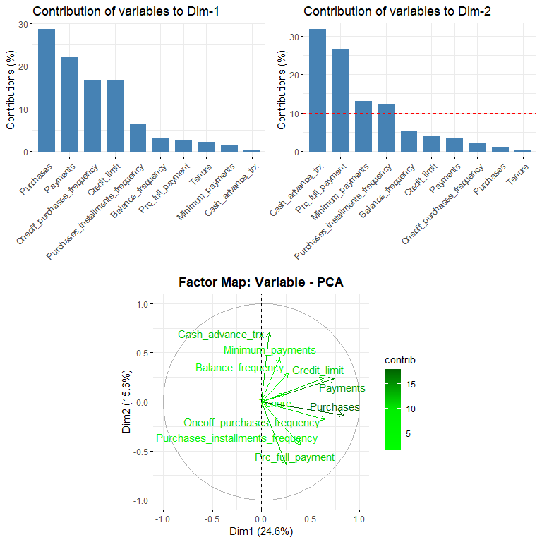
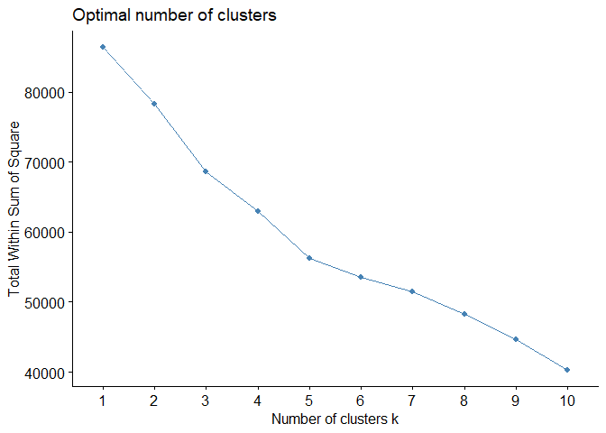
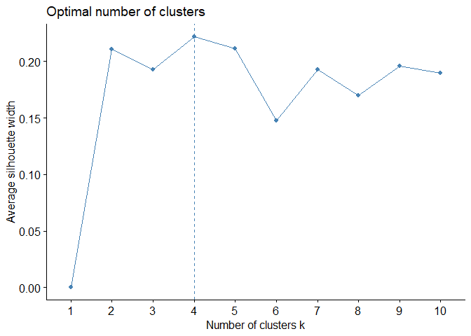

Credit card Market Segmentation by Auto-Clustering
================
Kar Ng
2022-05

-   [1 R PACKAGES](#1-r-packages)
-   [2 INTRODUCTION](#2-introduction)
-   [3 DATA PREPARATION](#3-data-preparation)
    -   [3.1 Data Import](#31-data-import)
    -   [3.2 Data Description](#32-data-description)
    -   [3.3 Data Exploration](#33-data-exploration)
-   [4 DATA CLEANING](#4-data-cleaning)
    -   [4.1 Rename all variables](#41-rename-all-variables)
    -   [4.2 NA Removal](#42-na-removal)
-   [5 EDA](#5-eda)
-   [6 CLUSTERING](#6-clustering)
    -   [6.1 Clustering Tendency
        Assessment](#61-clustering-tendency-assessment)
    -   [6.2 Find Optimal K](#62-find-optimal-k)
        -   [6.3.1 Elbow Method](#631-elbow-method)
        -   [6.3.2 Silhouette Method](#632-silhouette-method)
    -   [6.3 Hierarchical K-Means
        Clustering](#63-hierarchical-k-means-clustering)
    -   [6.4 Fuzzy Clustering](#64-fuzzy-clustering)
    -   [](#section)
-   [REFERENCE](#reference)

## 1 R PACKAGES

``` r
library(tidyverse)
library(kableExtra)
library(skimr)
library(factoextra)
library(hopkins)
library(clValid)
library(NbClust)
```

## 2 INTRODUCTION

This project will use clustering technique to develop a customer
segmentation to define marketing strategy.

Dataset used in this project is called “Credit Card Dataset for
Clustering” by Arjun Bhasin. It is a public dataset acquired from
[Kaggle.com](https://www.kaggle.com/datasets/arjunbhasin2013/ccdata).

The dataset has 17 behavioral information of about 9000 active credit
card holders.

## 3 DATA PREPARATION

### 3.1 Data Import

Following codes import the dataset and specify the first column as row’s
name, as it is required to perform clustering.

``` r
cc <- read.csv("cc_dataset.csv",
               header = T,
               row.names = 1)   # specificy column 1 as row name 
```

randomly sample the first 10 rows of the dataset.

``` r
sample_n(cc, 10)
```

    ##           BALANCE BALANCE_FREQUENCY PURCHASES ONEOFF_PURCHASES
    ## C16617  326.55185          0.818182   2950.77          2950.77
    ## C18786  117.34488          1.000000    661.30             0.00
    ## C11298  939.10276          0.363636      0.00             0.00
    ## C17034  162.04647          1.000000   1768.05             0.00
    ## C13862  716.97097          1.000000    378.35             0.00
    ## C18199   15.58700          0.545455    156.00             0.00
    ## C12344 1301.54928          1.000000      0.00             0.00
    ## C16508 5239.14687          1.000000     57.91            57.91
    ## C17562   36.57785          0.545455    561.48             0.00
    ## C19137 1117.59440          1.000000    291.62             0.00
    ##        INSTALLMENTS_PURCHASES CASH_ADVANCE PURCHASES_FREQUENCY
    ## C16617                   0.00      0.00000            0.583333
    ## C18786                 661.30    477.82555            1.000000
    ## C11298                   0.00   3470.93955            0.000000
    ## C17034                1768.05      0.00000            1.000000
    ## C13862                 378.35    801.87945            1.000000
    ## C18199                 156.00      0.00000            0.545455
    ## C12344                   0.00     72.68158            0.000000
    ## C16508                   0.00   2973.96681            0.083333
    ## C17562                 561.48      0.00000            0.500000
    ## C19137                 291.62   1596.77192            1.000000
    ##        ONEOFF_PURCHASES_FREQUENCY PURCHASES_INSTALLMENTS_FREQUENCY
    ## C16617                   0.583333                         0.000000
    ## C18786                   0.000000                         0.900000
    ## C11298                   0.000000                         0.000000
    ## C17034                   0.000000                         1.000000
    ## C13862                   0.000000                         0.857143
    ## C18199                   0.000000                         0.545455
    ## C12344                   0.000000                         0.000000
    ## C16508                   0.083333                         0.000000
    ## C17562                   0.000000                         0.416667
    ## C19137                   0.000000                         0.857143
    ##        CASH_ADVANCE_FREQUENCY CASH_ADVANCE_TRX PURCHASES_TRX CREDIT_LIMIT
    ## C16617               0.000000                0            35         4000
    ## C18786               0.100000                1            13         1200
    ## C11298               0.166667                4             0         4000
    ## C17034               0.000000                0            18         5000
    ## C13862               0.428571                8             7         1000
    ## C18199               0.000000                0             6         2000
    ## C12344               0.083333                1             0         1500
    ## C16508               0.250000                4             1         6000
    ## C17562               0.000000                0             6         3000
    ## C19137               0.142857                2             7         2000
    ##          PAYMENTS MINIMUM_PAYMENTS PRC_FULL_PAYMENT TENURE
    ## C16617 2224.27469        182.35313         0.571429     12
    ## C18786  562.89665        150.94029         0.250000     10
    ## C11298  501.82779        855.39844         0.000000     12
    ## C17034 1668.05446        172.80434         0.916667     12
    ## C13862  211.73438        317.66520         0.000000      7
    ## C18199  168.72631         81.86127         0.200000     11
    ## C12344  317.21162        531.39872         0.000000     12
    ## C16508 1218.11475       1737.03375         0.000000     12
    ## C17562  891.70861        167.28607         1.000000     12
    ## C19137   74.05593        382.84620         0.000000      7

The name of all variables are:

``` r
names(cc)
```

    ##  [1] "BALANCE"                          "BALANCE_FREQUENCY"               
    ##  [3] "PURCHASES"                        "ONEOFF_PURCHASES"                
    ##  [5] "INSTALLMENTS_PURCHASES"           "CASH_ADVANCE"                    
    ##  [7] "PURCHASES_FREQUENCY"              "ONEOFF_PURCHASES_FREQUENCY"      
    ##  [9] "PURCHASES_INSTALLMENTS_FREQUENCY" "CASH_ADVANCE_FREQUENCY"          
    ## [11] "CASH_ADVANCE_TRX"                 "PURCHASES_TRX"                   
    ## [13] "CREDIT_LIMIT"                     "PAYMENTS"                        
    ## [15] "MINIMUM_PAYMENTS"                 "PRC_FULL_PAYMENT"                
    ## [17] "TENURE"

### 3.2 Data Description

Following is the data description extracted from the kaggle website.

``` r
Variables <- c("CUSTID", "BALANCE", "BALANCEFREQUENCY", "PURCHASES", "ONEOFFPURCHASES",
               "INSTALLMENTSPURCHASES", "CASHADVANCE", "PURCHASESFREQUENCY", "ONEOFFPURCHASESFREQUENCY", "PURCHASESINSTALLMENTSFREQUENCY", "CASHADVANCEFREQUENCY", "CASHADVANCETRX", "PURCHASESTRX", "CREDITLIMIT", "PAYMENTS", "MINIMUM_PAYMENTS", "PRCFULLPAYMENT", "TENURE")

Description <- c("Identification of Credit Card holder (Categorical)",
                 "Balance amount left in their account to make purchases",
                 "How frequently the Balance is updated, score between 0 and 1 (1 = frequently updated, 0 = not frequently updated)",
                 "Amount of purchases made from account",
                 "Maximum purchase amount done in one-go",
                 "Amount of purchase done in installment",
                 "Cash in advance given by the user",
                 "How frequently the Purchases are being made, score between 0 and 1 (1 = frequently purchased, 0 = not frequently purchased)",
                 "How frequently Purchases are happening in one-go (1 = frequently purchased, 0 = not frequently purchased)",
                 "How frequently purchases in installments are being done (1 = frequently done, 0 = not frequently done)",
                 "How frequently the cash in advance being paid",
                 "Number of Transactions made with Cash in Advanced",
                 "Number of purchase transactions made",
                 "Limit of Credit Card for user",
                 "Amount of Payment done by user",
                 "Minimum amount of payments made by user",
                 "Percent of full payment paid by user",
                 "Tenure of credit card service for user")


data.frame(Variables, Description) %>% 
  kbl() %>% 
  kable_styling(bootstrap_options = c("bordered", "stripped"))
```

<table class="table table-bordered" style="margin-left: auto; margin-right: auto;">
<thead>
<tr>
<th style="text-align:left;">
Variables
</th>
<th style="text-align:left;">
Description
</th>
</tr>
</thead>
<tbody>
<tr>
<td style="text-align:left;">
CUSTID
</td>
<td style="text-align:left;">
Identification of Credit Card holder (Categorical)
</td>
</tr>
<tr>
<td style="text-align:left;">
BALANCE
</td>
<td style="text-align:left;">
Balance amount left in their account to make purchases
</td>
</tr>
<tr>
<td style="text-align:left;">
BALANCEFREQUENCY
</td>
<td style="text-align:left;">
How frequently the Balance is updated, score between 0 and 1 (1 =
frequently updated, 0 = not frequently updated)
</td>
</tr>
<tr>
<td style="text-align:left;">
PURCHASES
</td>
<td style="text-align:left;">
Amount of purchases made from account
</td>
</tr>
<tr>
<td style="text-align:left;">
ONEOFFPURCHASES
</td>
<td style="text-align:left;">
Maximum purchase amount done in one-go
</td>
</tr>
<tr>
<td style="text-align:left;">
INSTALLMENTSPURCHASES
</td>
<td style="text-align:left;">
Amount of purchase done in installment
</td>
</tr>
<tr>
<td style="text-align:left;">
CASHADVANCE
</td>
<td style="text-align:left;">
Cash in advance given by the user
</td>
</tr>
<tr>
<td style="text-align:left;">
PURCHASESFREQUENCY
</td>
<td style="text-align:left;">
How frequently the Purchases are being made, score between 0 and 1 (1 =
frequently purchased, 0 = not frequently purchased)
</td>
</tr>
<tr>
<td style="text-align:left;">
ONEOFFPURCHASESFREQUENCY
</td>
<td style="text-align:left;">
How frequently Purchases are happening in one-go (1 = frequently
purchased, 0 = not frequently purchased)
</td>
</tr>
<tr>
<td style="text-align:left;">
PURCHASESINSTALLMENTSFREQUENCY
</td>
<td style="text-align:left;">
How frequently purchases in installments are being done (1 = frequently
done, 0 = not frequently done)
</td>
</tr>
<tr>
<td style="text-align:left;">
CASHADVANCEFREQUENCY
</td>
<td style="text-align:left;">
How frequently the cash in advance being paid
</td>
</tr>
<tr>
<td style="text-align:left;">
CASHADVANCETRX
</td>
<td style="text-align:left;">
Number of Transactions made with Cash in Advanced
</td>
</tr>
<tr>
<td style="text-align:left;">
PURCHASESTRX
</td>
<td style="text-align:left;">
Number of purchase transactions made
</td>
</tr>
<tr>
<td style="text-align:left;">
CREDITLIMIT
</td>
<td style="text-align:left;">
Limit of Credit Card for user
</td>
</tr>
<tr>
<td style="text-align:left;">
PAYMENTS
</td>
<td style="text-align:left;">
Amount of Payment done by user
</td>
</tr>
<tr>
<td style="text-align:left;">
MINIMUM_PAYMENTS
</td>
<td style="text-align:left;">
Minimum amount of payments made by user
</td>
</tr>
<tr>
<td style="text-align:left;">
PRCFULLPAYMENT
</td>
<td style="text-align:left;">
Percent of full payment paid by user
</td>
</tr>
<tr>
<td style="text-align:left;">
TENURE
</td>
<td style="text-align:left;">
Tenure of credit card service for user
</td>
</tr>
</tbody>
</table>

### 3.3 Data Exploration

**Data Size and type**

The dataset contain 8950 rows and 17 variables. The “dbl” and “ind” are
data type allocated by R to a particular column. The “dbl” stands for
“double”, it is used for numerical variables that have decimal places.
The “int” stands for integer, it is used for numerical variables that
have integer values. All variables are numeric with either “dbl” and
“int”, they will be treated the same type during analysis.

``` r
glimpse(cc)
```

    ## Rows: 8,950
    ## Columns: 17
    ## $ BALANCE                          <dbl> 40.90075, 3202.46742, 2495.14886, 166~
    ## $ BALANCE_FREQUENCY                <dbl> 0.818182, 0.909091, 1.000000, 0.63636~
    ## $ PURCHASES                        <dbl> 95.40, 0.00, 773.17, 1499.00, 16.00, ~
    ## $ ONEOFF_PURCHASES                 <dbl> 0.00, 0.00, 773.17, 1499.00, 16.00, 0~
    ## $ INSTALLMENTS_PURCHASES           <dbl> 95.40, 0.00, 0.00, 0.00, 0.00, 1333.2~
    ## $ CASH_ADVANCE                     <dbl> 0.0000, 6442.9455, 0.0000, 205.7880, ~
    ## $ PURCHASES_FREQUENCY              <dbl> 0.166667, 0.000000, 1.000000, 0.08333~
    ## $ ONEOFF_PURCHASES_FREQUENCY       <dbl> 0.000000, 0.000000, 1.000000, 0.08333~
    ## $ PURCHASES_INSTALLMENTS_FREQUENCY <dbl> 0.083333, 0.000000, 0.000000, 0.00000~
    ## $ CASH_ADVANCE_FREQUENCY           <dbl> 0.000000, 0.250000, 0.000000, 0.08333~
    ## $ CASH_ADVANCE_TRX                 <int> 0, 4, 0, 1, 0, 0, 0, 0, 0, 0, 0, 0, 0~
    ## $ PURCHASES_TRX                    <int> 2, 0, 12, 1, 1, 8, 64, 12, 5, 3, 12, ~
    ## $ CREDIT_LIMIT                     <dbl> 1000, 7000, 7500, 7500, 1200, 1800, 1~
    ## $ PAYMENTS                         <dbl> 201.8021, 4103.0326, 622.0667, 0.0000~
    ## $ MINIMUM_PAYMENTS                 <dbl> 139.50979, 1072.34022, 627.28479, NA,~
    ## $ PRC_FULL_PAYMENT                 <dbl> 0.000000, 0.222222, 0.000000, 0.00000~
    ## $ TENURE                           <int> 12, 12, 12, 12, 12, 12, 12, 12, 12, 1~

**Purchases**

During exploration, I found that “PURCHASES” is the sum of
“ONEOFF_PURCHASES” and “INSTALLMENTS_PURCHASES”. It may not be important
in this analysis.

Following select 10 rows among the dataset, and the new variable
“MY_PURCHASES” proves my finding, which is the same as the “PURCHASES”,
and is the sum of “ONEOFF_PURCHASES” and “INSTALLMENTS_PURCHASES”.

``` r
cc %>% 
  top_n(10, BALANCE) %>% 
  dplyr::select(ONEOFF_PURCHASES, INSTALLMENTS_PURCHASES, PURCHASES) %>% 
  mutate(MY_PURCHASES = ONEOFF_PURCHASES + INSTALLMENTS_PURCHASES)
```

    ##        ONEOFF_PURCHASES INSTALLMENTS_PURCHASES PURCHASES MY_PURCHASES
    ## C10144          9449.07               12560.85  22009.92     22009.92
    ## C10544           529.30                   0.00    529.30       529.30
    ## C10609          7564.81                 258.93   7823.74      7823.74
    ## C10914             0.00                   0.00      0.00         0.00
    ## C12434             0.00                1168.75   1168.75      1168.75
    ## C14256          3657.30                1630.98   5288.28      5288.28
    ## C14836           717.24                   0.00    717.24       717.24
    ## C15429           105.30                 579.44    684.74       684.74
    ## C15642             0.00                1770.57   1770.57      1770.57
    ## C16812          3582.45                1442.23   5024.68      5024.68

**Missing values check**

Again, proven by other function that the tables have 8950 rows of data
and 17 variables. All variables are numerical, and, by examining the
variables “n_missing” and “complete_rate” in following tables, there is
1 missing value in the variable “CREDIT_LIMIT” and 313 in the
“MINIMUM_PAYMENTS”. These missing values need to be handled.

``` r
skim_without_charts(cc)
```

<table style="width: auto;" class="table table-condensed">
<caption>
Data summary
</caption>
<thead>
<tr>
<th style="text-align:left;">
</th>
<th style="text-align:left;">
</th>
</tr>
</thead>
<tbody>
<tr>
<td style="text-align:left;">
Name
</td>
<td style="text-align:left;">
cc
</td>
</tr>
<tr>
<td style="text-align:left;">
Number of rows
</td>
<td style="text-align:left;">
8950
</td>
</tr>
<tr>
<td style="text-align:left;">
Number of columns
</td>
<td style="text-align:left;">
17
</td>
</tr>
<tr>
<td style="text-align:left;">
\_\_\_\_\_\_\_\_\_\_\_\_\_\_\_\_\_\_\_\_\_\_\_
</td>
<td style="text-align:left;">
</td>
</tr>
<tr>
<td style="text-align:left;">
Column type frequency:
</td>
<td style="text-align:left;">
</td>
</tr>
<tr>
<td style="text-align:left;">
numeric
</td>
<td style="text-align:left;">
17
</td>
</tr>
<tr>
<td style="text-align:left;">
\_\_\_\_\_\_\_\_\_\_\_\_\_\_\_\_\_\_\_\_\_\_\_\_
</td>
<td style="text-align:left;">
</td>
</tr>
<tr>
<td style="text-align:left;">
Group variables
</td>
<td style="text-align:left;">
None
</td>
</tr>
</tbody>
</table>

**Variable type: numeric**

<table>
<thead>
<tr>
<th style="text-align:left;">
skim_variable
</th>
<th style="text-align:right;">
n_missing
</th>
<th style="text-align:right;">
complete_rate
</th>
<th style="text-align:right;">
mean
</th>
<th style="text-align:right;">
sd
</th>
<th style="text-align:right;">
p0
</th>
<th style="text-align:right;">
p25
</th>
<th style="text-align:right;">
p50
</th>
<th style="text-align:right;">
p75
</th>
<th style="text-align:right;">
p100
</th>
</tr>
</thead>
<tbody>
<tr>
<td style="text-align:left;">
BALANCE
</td>
<td style="text-align:right;">
0
</td>
<td style="text-align:right;">
1.00
</td>
<td style="text-align:right;">
1564.47
</td>
<td style="text-align:right;">
2081.53
</td>
<td style="text-align:right;">
0.00
</td>
<td style="text-align:right;">
128.28
</td>
<td style="text-align:right;">
873.39
</td>
<td style="text-align:right;">
2054.14
</td>
<td style="text-align:right;">
19043.14
</td>
</tr>
<tr>
<td style="text-align:left;">
BALANCE_FREQUENCY
</td>
<td style="text-align:right;">
0
</td>
<td style="text-align:right;">
1.00
</td>
<td style="text-align:right;">
0.88
</td>
<td style="text-align:right;">
0.24
</td>
<td style="text-align:right;">
0.00
</td>
<td style="text-align:right;">
0.89
</td>
<td style="text-align:right;">
1.00
</td>
<td style="text-align:right;">
1.00
</td>
<td style="text-align:right;">
1.00
</td>
</tr>
<tr>
<td style="text-align:left;">
PURCHASES
</td>
<td style="text-align:right;">
0
</td>
<td style="text-align:right;">
1.00
</td>
<td style="text-align:right;">
1003.20
</td>
<td style="text-align:right;">
2136.63
</td>
<td style="text-align:right;">
0.00
</td>
<td style="text-align:right;">
39.63
</td>
<td style="text-align:right;">
361.28
</td>
<td style="text-align:right;">
1110.13
</td>
<td style="text-align:right;">
49039.57
</td>
</tr>
<tr>
<td style="text-align:left;">
ONEOFF_PURCHASES
</td>
<td style="text-align:right;">
0
</td>
<td style="text-align:right;">
1.00
</td>
<td style="text-align:right;">
592.44
</td>
<td style="text-align:right;">
1659.89
</td>
<td style="text-align:right;">
0.00
</td>
<td style="text-align:right;">
0.00
</td>
<td style="text-align:right;">
38.00
</td>
<td style="text-align:right;">
577.41
</td>
<td style="text-align:right;">
40761.25
</td>
</tr>
<tr>
<td style="text-align:left;">
INSTALLMENTS_PURCHASES
</td>
<td style="text-align:right;">
0
</td>
<td style="text-align:right;">
1.00
</td>
<td style="text-align:right;">
411.07
</td>
<td style="text-align:right;">
904.34
</td>
<td style="text-align:right;">
0.00
</td>
<td style="text-align:right;">
0.00
</td>
<td style="text-align:right;">
89.00
</td>
<td style="text-align:right;">
468.64
</td>
<td style="text-align:right;">
22500.00
</td>
</tr>
<tr>
<td style="text-align:left;">
CASH_ADVANCE
</td>
<td style="text-align:right;">
0
</td>
<td style="text-align:right;">
1.00
</td>
<td style="text-align:right;">
978.87
</td>
<td style="text-align:right;">
2097.16
</td>
<td style="text-align:right;">
0.00
</td>
<td style="text-align:right;">
0.00
</td>
<td style="text-align:right;">
0.00
</td>
<td style="text-align:right;">
1113.82
</td>
<td style="text-align:right;">
47137.21
</td>
</tr>
<tr>
<td style="text-align:left;">
PURCHASES_FREQUENCY
</td>
<td style="text-align:right;">
0
</td>
<td style="text-align:right;">
1.00
</td>
<td style="text-align:right;">
0.49
</td>
<td style="text-align:right;">
0.40
</td>
<td style="text-align:right;">
0.00
</td>
<td style="text-align:right;">
0.08
</td>
<td style="text-align:right;">
0.50
</td>
<td style="text-align:right;">
0.92
</td>
<td style="text-align:right;">
1.00
</td>
</tr>
<tr>
<td style="text-align:left;">
ONEOFF_PURCHASES_FREQUENCY
</td>
<td style="text-align:right;">
0
</td>
<td style="text-align:right;">
1.00
</td>
<td style="text-align:right;">
0.20
</td>
<td style="text-align:right;">
0.30
</td>
<td style="text-align:right;">
0.00
</td>
<td style="text-align:right;">
0.00
</td>
<td style="text-align:right;">
0.08
</td>
<td style="text-align:right;">
0.30
</td>
<td style="text-align:right;">
1.00
</td>
</tr>
<tr>
<td style="text-align:left;">
PURCHASES_INSTALLMENTS_FREQUENCY
</td>
<td style="text-align:right;">
0
</td>
<td style="text-align:right;">
1.00
</td>
<td style="text-align:right;">
0.36
</td>
<td style="text-align:right;">
0.40
</td>
<td style="text-align:right;">
0.00
</td>
<td style="text-align:right;">
0.00
</td>
<td style="text-align:right;">
0.17
</td>
<td style="text-align:right;">
0.75
</td>
<td style="text-align:right;">
1.00
</td>
</tr>
<tr>
<td style="text-align:left;">
CASH_ADVANCE_FREQUENCY
</td>
<td style="text-align:right;">
0
</td>
<td style="text-align:right;">
1.00
</td>
<td style="text-align:right;">
0.14
</td>
<td style="text-align:right;">
0.20
</td>
<td style="text-align:right;">
0.00
</td>
<td style="text-align:right;">
0.00
</td>
<td style="text-align:right;">
0.00
</td>
<td style="text-align:right;">
0.22
</td>
<td style="text-align:right;">
1.50
</td>
</tr>
<tr>
<td style="text-align:left;">
CASH_ADVANCE_TRX
</td>
<td style="text-align:right;">
0
</td>
<td style="text-align:right;">
1.00
</td>
<td style="text-align:right;">
3.25
</td>
<td style="text-align:right;">
6.82
</td>
<td style="text-align:right;">
0.00
</td>
<td style="text-align:right;">
0.00
</td>
<td style="text-align:right;">
0.00
</td>
<td style="text-align:right;">
4.00
</td>
<td style="text-align:right;">
123.00
</td>
</tr>
<tr>
<td style="text-align:left;">
PURCHASES_TRX
</td>
<td style="text-align:right;">
0
</td>
<td style="text-align:right;">
1.00
</td>
<td style="text-align:right;">
14.71
</td>
<td style="text-align:right;">
24.86
</td>
<td style="text-align:right;">
0.00
</td>
<td style="text-align:right;">
1.00
</td>
<td style="text-align:right;">
7.00
</td>
<td style="text-align:right;">
17.00
</td>
<td style="text-align:right;">
358.00
</td>
</tr>
<tr>
<td style="text-align:left;">
CREDIT_LIMIT
</td>
<td style="text-align:right;">
1
</td>
<td style="text-align:right;">
1.00
</td>
<td style="text-align:right;">
4494.45
</td>
<td style="text-align:right;">
3638.82
</td>
<td style="text-align:right;">
50.00
</td>
<td style="text-align:right;">
1600.00
</td>
<td style="text-align:right;">
3000.00
</td>
<td style="text-align:right;">
6500.00
</td>
<td style="text-align:right;">
30000.00
</td>
</tr>
<tr>
<td style="text-align:left;">
PAYMENTS
</td>
<td style="text-align:right;">
0
</td>
<td style="text-align:right;">
1.00
</td>
<td style="text-align:right;">
1733.14
</td>
<td style="text-align:right;">
2895.06
</td>
<td style="text-align:right;">
0.00
</td>
<td style="text-align:right;">
383.28
</td>
<td style="text-align:right;">
856.90
</td>
<td style="text-align:right;">
1901.13
</td>
<td style="text-align:right;">
50721.48
</td>
</tr>
<tr>
<td style="text-align:left;">
MINIMUM_PAYMENTS
</td>
<td style="text-align:right;">
313
</td>
<td style="text-align:right;">
0.97
</td>
<td style="text-align:right;">
864.21
</td>
<td style="text-align:right;">
2372.45
</td>
<td style="text-align:right;">
0.02
</td>
<td style="text-align:right;">
169.12
</td>
<td style="text-align:right;">
312.34
</td>
<td style="text-align:right;">
825.49
</td>
<td style="text-align:right;">
76406.21
</td>
</tr>
<tr>
<td style="text-align:left;">
PRC_FULL_PAYMENT
</td>
<td style="text-align:right;">
0
</td>
<td style="text-align:right;">
1.00
</td>
<td style="text-align:right;">
0.15
</td>
<td style="text-align:right;">
0.29
</td>
<td style="text-align:right;">
0.00
</td>
<td style="text-align:right;">
0.00
</td>
<td style="text-align:right;">
0.00
</td>
<td style="text-align:right;">
0.14
</td>
<td style="text-align:right;">
1.00
</td>
</tr>
<tr>
<td style="text-align:left;">
TENURE
</td>
<td style="text-align:right;">
0
</td>
<td style="text-align:right;">
1.00
</td>
<td style="text-align:right;">
11.52
</td>
<td style="text-align:right;">
1.34
</td>
<td style="text-align:right;">
6.00
</td>
<td style="text-align:right;">
12.00
</td>
<td style="text-align:right;">
12.00
</td>
<td style="text-align:right;">
12.00
</td>
<td style="text-align:right;">
12.00
</td>
</tr>
</tbody>
</table>

Alternatively, following code performs the missing-value check.

``` r
colSums(is.na(cc))
```

    ##                          BALANCE                BALANCE_FREQUENCY 
    ##                                0                                0 
    ##                        PURCHASES                 ONEOFF_PURCHASES 
    ##                                0                                0 
    ##           INSTALLMENTS_PURCHASES                     CASH_ADVANCE 
    ##                                0                                0 
    ##              PURCHASES_FREQUENCY       ONEOFF_PURCHASES_FREQUENCY 
    ##                                0                                0 
    ## PURCHASES_INSTALLMENTS_FREQUENCY           CASH_ADVANCE_FREQUENCY 
    ##                                0                                0 
    ##                 CASH_ADVANCE_TRX                    PURCHASES_TRX 
    ##                                0                                0 
    ##                     CREDIT_LIMIT                         PAYMENTS 
    ##                                1                                0 
    ##                 MINIMUM_PAYMENTS                 PRC_FULL_PAYMENT 
    ##                              313                                0 
    ##                           TENURE 
    ##                                0

There are 8950 rows of data and I will still have 96.5% of data left
after removal of these missing values and therefore I will simply remove
these missing values for the simplicity of this project.

Typically, missing value can be handled by either removal, replaced with
mean, median, or using imputation algorithm such as KNN or bagging
algorithm. These techniques are usually performed when there are too
many missing values in important variables. For example, when missing
values is higher than 5% and less than 60%.

## 4 DATA CLEANING

### 4.1 Rename all variables

The name of all variables are in capital form and which would be
difficult to read for readers and also myself.

``` r
colnames(cc)
```

    ##  [1] "BALANCE"                          "BALANCE_FREQUENCY"               
    ##  [3] "PURCHASES"                        "ONEOFF_PURCHASES"                
    ##  [5] "INSTALLMENTS_PURCHASES"           "CASH_ADVANCE"                    
    ##  [7] "PURCHASES_FREQUENCY"              "ONEOFF_PURCHASES_FREQUENCY"      
    ##  [9] "PURCHASES_INSTALLMENTS_FREQUENCY" "CASH_ADVANCE_FREQUENCY"          
    ## [11] "CASH_ADVANCE_TRX"                 "PURCHASES_TRX"                   
    ## [13] "CREDIT_LIMIT"                     "PAYMENTS"                        
    ## [15] "MINIMUM_PAYMENTS"                 "PRC_FULL_PAYMENT"                
    ## [17] "TENURE"

Following code transforms all the name into reading-friendly form.

``` r
cc <- cc %>% 
  rename_all(str_to_sentence)
```

Checking again the name of each variable.

``` r
colnames(cc)
```

    ##  [1] "Balance"                          "Balance_frequency"               
    ##  [3] "Purchases"                        "Oneoff_purchases"                
    ##  [5] "Installments_purchases"           "Cash_advance"                    
    ##  [7] "Purchases_frequency"              "Oneoff_purchases_frequency"      
    ##  [9] "Purchases_installments_frequency" "Cash_advance_frequency"          
    ## [11] "Cash_advance_trx"                 "Purchases_trx"                   
    ## [13] "Credit_limit"                     "Payments"                        
    ## [15] "Minimum_payments"                 "Prc_full_payment"                
    ## [17] "Tenure"

### 4.2 NA Removal

Following code remove all the missing values in the dataset (314 rows
among 8950 rows)

``` r
cc <- cc %>% 
  na.omit()
```

Now, the number of rows have been reduced to 8636 from 8950.

``` r
str(cc)
```

    ## 'data.frame':    8636 obs. of  17 variables:
    ##  $ Balance                         : num  40.9 3202.5 2495.1 817.7 1809.8 ...
    ##  $ Balance_frequency               : num  0.818 0.909 1 1 1 ...
    ##  $ Purchases                       : num  95.4 0 773.2 16 1333.3 ...
    ##  $ Oneoff_purchases                : num  0 0 773 16 0 ...
    ##  $ Installments_purchases          : num  95.4 0 0 0 1333.3 ...
    ##  $ Cash_advance                    : num  0 6443 0 0 0 ...
    ##  $ Purchases_frequency             : num  0.1667 0 1 0.0833 0.6667 ...
    ##  $ Oneoff_purchases_frequency      : num  0 0 1 0.0833 0 ...
    ##  $ Purchases_installments_frequency: num  0.0833 0 0 0 0.5833 ...
    ##  $ Cash_advance_frequency          : num  0 0.25 0 0 0 0 0 0 0 0 ...
    ##  $ Cash_advance_trx                : int  0 4 0 0 0 0 0 0 0 0 ...
    ##  $ Purchases_trx                   : int  2 0 12 1 8 64 12 5 3 12 ...
    ##  $ Credit_limit                    : num  1000 7000 7500 1200 1800 13500 2300 7000 11000 1200 ...
    ##  $ Payments                        : num  202 4103 622 678 1400 ...
    ##  $ Minimum_payments                : num  140 1072 627 245 2407 ...
    ##  $ Prc_full_payment                : num  0 0.222 0 0 0 ...
    ##  $ Tenure                          : int  12 12 12 12 12 12 12 12 12 12 ...
    ##  - attr(*, "na.action")= 'omit' Named int [1:314] 4 46 48 55 56 57 64 94 95 98 ...
    ##   ..- attr(*, "names")= chr [1:314] "C10004" "C10047" "C10049" "C10056" ...

## 5 EDA

**Distribution Study**

A primary exploratory data analysis is suggested to quickly understand
the general distribution of the data.

``` r
# data frame

cc2 <- cc %>% 
  pivot_longer(c(1:17), 
               names_to = "my.variable", 
               values_to = "my.value")

# graphs

ggplot(cc2, aes(x = my.value, fill = my.variable)) +
  geom_histogram(color = "black") +
  facet_wrap(~my.variable, scale = "free") +
  theme_minimal() +
  theme(legend.position = "none", 
        axis.text.x = element_text(angle = 45),
        plot.title = element_text(face = "bold", hjust = 0.5),
        plot.subtitle = element_text(hjust = 0.5, face = "bold")) +
  labs(title = "Variable Distribution Analysis",
       subtitle = "by Histogram")
```

<!-- -->

Most of the variables follow Pareto trend (80:20 rule) with majority of
the data belong to one side of the value. it can be seem quite hard to
group the data and categories the data into several distinct group for
marketing purposes.

## 6 CLUSTERING

The dataset must met several conditions prior to be clustered,

1.  Observation as row and variable as variable, and it has been met.  
2.  No missing values in the dataset, and it has been met.  
3.  Standardising the data (generally recommended) to make variables
    comparable. This step will transform the data in all variables to a
    scale that would have 0 mean and 1 standard deviation. This step
    will be performed in this section.

Standardising the dataset:

``` r
cc.scale <- scale(cc)
```

Showing the first 6 rows of the data:

``` r
head(cc.scale)
```

    ##           Balance Balance_frequency  Purchases Oneoff_purchases
    ## C10001 -0.7445817       -0.37002536 -0.4291590      -0.35913949
    ## C10002  0.7641079        0.06767501 -0.4731808      -0.35913949
    ## C10003  0.4265777        0.50537539 -0.1164058       0.09990369
    ## C10005 -0.3738888        0.50537539 -0.4657977      -0.34964003
    ## C10006  0.0995451        0.50537539  0.1420539      -0.35913949
    ## C10007 -0.4647726        0.50537539  2.7989266       3.44220252
    ##        Installments_purchases Cash_advance Purchases_frequency
    ## C10001             -0.3548054   -0.4686284          -0.8207213
    ## C10002             -0.4588125    2.5684078          -1.2360673
    ## C10003             -0.4588125   -0.4686284           1.2560039
    ## C10005             -0.4588125   -0.4686284          -1.0283956
    ## C10006              0.9947574   -0.4686284           0.4253143
    ## C10007              0.2916739   -0.4686284           1.2560039
    ##        Oneoff_purchases_frequency Purchases_installments_frequency
    ## C10001                 -0.6862398                       -0.7171374
    ## C10002                 -0.6862398                       -0.9264679
    ## C10003                  2.6464980                       -0.9264679
    ## C10005                 -0.4085128                       -0.9264679
    ## C10006                 -0.6862398                        0.5388507
    ## C10007                  2.6464980                        1.5855083
    ##        Cash_advance_frequency Cash_advance_trx Purchases_trx Credit_limit
    ## C10001             -0.6819130      -0.47940912    -0.5175930   -0.9625197
    ## C10002              0.5569899       0.09925221    -0.5970196    0.6771649
    ## C10003             -0.6819130      -0.47940912    -0.1204598    0.8138052
    ## C10005             -0.6819130      -0.47940912    -0.5573063   -0.9078636
    ## C10006             -0.6819130      -0.47940912    -0.2793130   -0.7438951
    ## C10007             -0.6819130      -0.47940912     1.9446329    2.4534898
    ##          Payments Minimum_payments Prc_full_payment    Tenure
    ## C10001 -0.5439104      -0.30548994       -0.5376958 0.3551601
    ## C10002  0.7968061       0.08768365        0.2123677 0.3551601
    ## C10003 -0.3994801      -0.09990033       -0.5376958 0.3551601
    ## C10005 -0.3801428      -0.26111544       -0.5376958 0.3551601
    ## C10006 -0.1321118       0.65032579       -0.5376958 0.3551601
    ## C10007  1.5704929      -0.28080945        2.8375934 0.3551601

There are different type of clustering methods such as partitioning
clustering which include “k-means clustering”, “PAM”, and “CLARA”, or
hierarchical clustering which include the famous “AGNES” and “DIANA”.

Partitioning and hierarchical clustering methods are alternative to each
other, and although automation with selection statistics are available
to choose the best algorithm for the dataset but I will not perform it
here, because I will perform an advanced “Hybrid” clustering technique
for this project, called “Hierarchical K-Means Clustering (hkmeans)”.
This technique combine both the algorithms.

### 6.1 Clustering Tendency Assessment

There is a big issue with clustering techniques is that it will always
return clusters even if there is no any cluster in the dataset.
Therefore, clustering tendency assessment is an important step to test
is there clusters in the dataset.

**Hopkins Statistics** is a statistical method that using probability to
test for spatial randomness of the data. The null hypothesis is that the
credit card dataset is uniformly distributed, indicating no meaningful
cluster.

-   If the value of hopkins statistic is low (0 - 3), it indicates
    regularly-spaced data  
-   if the value is around zero, it indicates random data  
-   If the value is around 0.7 to 1, it indicate clustered data

``` r
hopkins(cc.scale, m = nrow(cc.scale)-1)
```

    ## [1] 1

The Hopkins Statistics is 1, and base on this value I can reject the
null hypothesis and conclude that the credit card dataset is
significantly a clusterable data.

### 6.2 Find Optimal K

This section will use two typical methods among other popular methods to
find the optimal number of clusters (specified by “k”) that the dataset
is able to be clustered into. All methods should recommend the same or
highly similar value of optimal k.

In general, the optimal k is specified by the analyst of the project,
and it can a hard task. There is also no definite answer to say what k
is the best, it is subjective and relying on the selection of the
distance matrix and the parameters used for clustering the data.

#### 6.3.1 Elbow Method

Following shows the result of Elbow method. In Elbow method, clustering
algorithm is computed for different number of clusters (k). For each k,
the total within sum of square (WSS) is calculated.

The location of a bend (knee) is generally considered as an indicator of
appropriate k.

``` r
g1 <- fviz_nbclust(cc.scale, FUNcluster = kmeans, method = "wss")

g1 + geom_vline(xintercept = 7, linetype = 2)
```

<!-- -->

The optimal number of k might be 7.

#### 6.3.2 Silhouette Method

This method uses average silhouette width to determine the optimal
number of k. A high average silhouette width means good clustering.
Additionally, the algorithm will suggest the best k for the credit card
dataset, which is 9, although k-7 was also not too bad in term of
average silhouette width and is not too far away k-9.

``` r
fviz_nbclust(cc.scale, 
             FUNcluster = kmeans, 
             method = "silhouette")
```

<!-- --> Base on the
suggestions gained from Elbow and Silhouette method, I have decided to
use 7 as the optimal number of k.

### 6.3 Hierarchical K-Means Clustering

In this section, I will perform hkmeans, which is a method that combine
K-means clustering and hierarchical clustering to improve k-means
results.

The biggest limitation K-means clustering is that the final result is
subjected to the initial random selection of centroids. However, in
hkmeans, the selection of centroid is not based on randomisation but the
results of hierarchical clustering from the hk-mean algorithm, these
centroids are optimiased centroids. Therefore, in hierarchical k-means
clustering, the hierarchial clustering is being performed first,
followed by the k-means clustering.

Following summarise the combination of the two algorithms :

-   **Step 1**: Compute hierarchical clustering with the optimal K
    obtained from previous section. In this step, distance matrix
    between each pair of observation is computed and based on that, a
    linkage function is selected to group similar objects into
    hierarchical cluster tree. Each observation are considered a cluster
    on its on, then the forming of clustering move upward and form
    bigger cluster, and this step continues until the root is reached.
    Finally, the tree is cut into pre-specified K (which is 7 in this
    case).

-   **Step 2**: Compute the center (i.e. mean) of each cluster.
    Therefore, there are 7 new center here in each of the 7 clusters.

-   **Step 3**: Compute K-means clustering on the original normalised
    credit card dataset by using the set of cluster centers computed in
    step 2 as the initial cluster centers. Then, according to the
    algorithm of K-means clustering, each observations will be assigned
    to the closest centroid based on distance matrix (eg. euclidean).
    For each k-clusters, a new mean is being updated again by
    calculating the new mean value of all data points in the cluster.
    Finally, all observations are being re-allocated to these new means.
    The allocation of observations and the calculation of new means are
    iterated until the total within sum of square is minimised.

Following code complete the hkmeans.

``` r
# Create hierarchical k-means clustering

res.hk <- hkmeans(cc.scale, 
                 k = 7,
                 hc.metric = "euclidean",
                 hc.method = "ward.D2",
                 km.algorithm = "Hartigan-Wong")
```

The “res.hk” objects contain following results.

``` r
# Items created from the object

names(res.hk)
```

    ##  [1] "cluster"      "centers"      "totss"        "withinss"     "tot.withinss"
    ##  [6] "betweenss"    "size"         "iter"         "ifault"       "data"        
    ## [11] "hclust"

The dataset can be clustered (grouped) in 7 clusters (group), estimated
by this project, and these 7 clusters has following size:

``` r
res.hk$size
```

    ## [1] 2717  871 2655  671 1093  599   30

Graphical presentation of the results:

``` r
hk.cluster <- fviz_cluster(res.hk,
                           palette = "jco",
                           geom = "point") 
  
hk.cluster + 
  theme_classic() +
  theme(plot.title = element_text(hjust = 0.5, face = "bold"),
        plot.subtitle = element_text(hjust = 0.5)) +
  labs(title = "Hierarchical K-means Clustering Results",
       subtitle = "Hartigan-Wong algorithm + Euclidean + ward.D2 + K = 7")
```

<!-- -->

All the observation points are being converted and plotted onto
dimensional plots (Dim1 & Dim2). The dataset has been detected that it
is clusterable and optimal k was estimated as 7. However, there are
several clusters overlapping with each other, I start to question are
points really being clustered well?

In traditional clustering such as partitioning and hierarchical
clustering, observation points are assigned to exactly 1 cluster.

### 6.4 Fuzzy Clustering

This section performs an alternative to k-mean clustering. In K-mean
clustering or PAM, observations are assigned to exactly 1 cluster.
However, in fuzzy clustering, each observation has a probability of
belong to each cluster. Points that close to the center of a cluster
will have a higher probability than points that further away from a
center of points that belong to other cluster.

``` r
res.fanny <- fanny(cc.scale, k = 7, metric = "euclidean", stand = FALSE)
```

    ## Warning in fanny(cc.scale, k = 7, metric = "euclidean", stand = FALSE): the
    ## memberships are all very close to 1/k. Maybe decrease 'memb.exp' ?

Showing the member coefficient

``` r
head(res.fanny$membership, 10)
```

    ##             [,1]      [,2]      [,3]      [,4]      [,5]      [,6]      [,7]
    ## C10001 0.1428571 0.1428571 0.1428571 0.1428571 0.1428571 0.1428571 0.1428571
    ## C10002 0.1428571 0.1428571 0.1428571 0.1428571 0.1428571 0.1428571 0.1428571
    ## C10003 0.1428571 0.1428571 0.1428571 0.1428571 0.1428571 0.1428571 0.1428571
    ## C10005 0.1428571 0.1428571 0.1428571 0.1428571 0.1428571 0.1428571 0.1428571
    ## C10006 0.1428571 0.1428571 0.1428571 0.1428571 0.1428571 0.1428571 0.1428571
    ## C10007 0.1428571 0.1428571 0.1428571 0.1428571 0.1428571 0.1428571 0.1428571
    ## C10008 0.1428571 0.1428571 0.1428571 0.1428571 0.1428571 0.1428571 0.1428571
    ## C10009 0.1428571 0.1428571 0.1428571 0.1428571 0.1428571 0.1428571 0.1428571
    ## C10010 0.1428571 0.1428571 0.1428571 0.1428571 0.1428571 0.1428571 0.1428571
    ## C10011 0.1428571 0.1428571 0.1428571 0.1428571 0.1428571 0.1428571 0.1428571

``` r
head(res.fanny$coeff, 10)
```

    ##   dunn_coeff   normalized 
    ## 1.428571e-01 3.493502e-14

Following code show the cluster that each observation belongs to
(extracting the first 10 observations).

``` r
head(res.fanny$clustering, 10)
```

    ## C10001 C10002 C10003 C10005 C10006 C10007 C10008 C10009 C10010 C10011 
    ##      1      1      1      1      1      2      2      1      1      2

This

``` r
fviz_cluster(res.fanny, geom = "point", ellipse.type = "norm", repel = T,
             palette = "jco")
```

<!-- -->

``` r
fviz_silhouette(res.fanny, palette = "jco")
```

    ##   cluster size ave.sil.width
    ## 1       1 6993          0.24
    ## 2       2  905          0.14
    ## 3       3  623         -0.14
    ## 4       4   80         -0.17
    ## 5       5   35         -0.02

<!-- -->

### 

## REFERENCE

Alboukadel Kassambara 2017， *Practical Guide to Cluster Analysis in R*,
Multivariate Analysis 1, Edition 1, sthda.com
